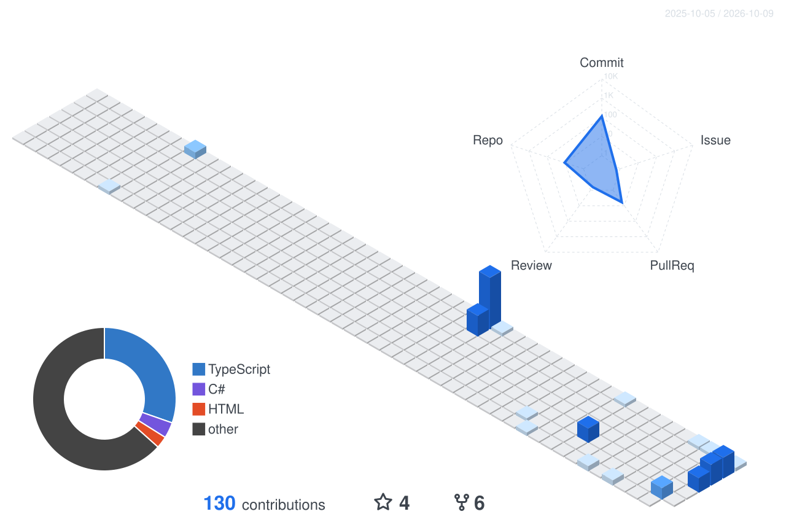

[简体中文](https://github.com/castorhrio) | **English**

# Hi, I'm Xyris

Backend engineer, mostly distributed systems and message queues.

Day to day that means breaking apart service boundaries, designing task scheduling, and dealing with the problems that only show up after you ship — request timeouts, downstream rate limits, machines dying. I want the system sturdy enough to hold up without anyone watching it.

The stack is .NET and Go for services, MySQL and Redis for data, RabbitMQ for messaging, running on Docker and Linux.

  
  
  

  
  
  
  
  
  
  

### Featured work

| Project | What it is |
| --- | --- |
| **[system-design-guide](https://github.com/castorhrio/system-design-guide)** · [live](https://castorhrio.github.io/system-design-guide/) | A system design tutorial, 28 chapters in Chinese, with 127 errata |
| **[callatlas](https://github.com/castorhrio/callatlas)** | Call graph tool for C#. Every edge comes from the compiler, none guessed |
| **[rehearsal](https://github.com/castorhrio/rehearsal)** | Run GitHub Actions locally and step through jobs like a debugger |
| **[win10-desktop-beautifier](https://github.com/castorhrio/win10-desktop-beautifier)** | Centred translucent Win10 taskbar, menu switches between Chinese and English, no system files |

More in the [repositories tab](https://github.com/castorhrio?tab=repositories). Writing up at [ponponboy.cn](https://ponponboy.cn/).

### Activity

  

 

  <picture>
    <source media="(prefers-color-scheme: dark)" srcset="https://raw.githubusercontent.com/castorhrio/castorhrio/output/github-contribution-grid-snake-dark.svg" />
    <source media="(prefers-color-scheme: light)" srcset="https://raw.githubusercontent.com/castorhrio/castorhrio/output/github-contribution-grid-snake.svg" />
    
  </picture>

 

  

---

<em>"Any fool can write code that a computer can understand. Good programmers write code that humans can understand." — Martin Fowler</em>

