<div align="center">


<br/>
<br/>

<a href="https://ponponboy.cn/" target="_blank">
  
</a>
&nbsp;
<a href="mailto:jojoseisai@gmail.com">
  
</a>
&nbsp;
<a href="https://github.com/castorhrio">
  
</a>
&nbsp;
<a href="https://music.163.com/#/artist?id=35888225">
  
</a>

</div>

---

## 🖥️ Terminal

<div align="center">
  
</div>

---

## 📊 Dashboard

<div align="center">
  
  
  <br/>
  
  <br/>
  
</div>

---

## 🐍 Contribution Snake

<picture>
  <source media="(prefers-color-scheme: dark)" srcset="https://raw.githubusercontent.com/castorhrio/castorhrio/output/github-contribution-grid-snake-dark.svg" />
  <source media="(prefers-color-scheme: light)" srcset="https://raw.githubusercontent.com/castorhrio/castorhrio/output/github-contribution-grid-snake.svg" />
  
</picture>

---

## 🙋‍♂️ About Me

> Backend & fullstack developer from China. I treat code as craftsmanship — every commit is a deliberate improvement.

- 🔭 **Currently** — Software Engineer, building enterprise web applications
- 🌱 **Learning** — Go · .NET Core · Node.js · Web3
- 💬 **Topics** — .NET architecture, Go patterns, API design, WeChat ecosystem integration
- ✍️ **Blog** — [ponponboy.cn](https://ponponboy.cn/)
- 🎵 **Music** — [NetEase Music](https://music.163.com/#/artist?id=35888225)
- ⚡ **Fun fact** — *Writing code is like creating a binary copy of myself*

| Domain | Details |
|---|---|
| 🔧 **Infra & Tooling** | Load generator in Go; Excel → MySQL ETL pipeline; common utility libraries |
| 💬 **Real-time Systems** | IM system in Go with WebSocket-based communication |
| 🗄️ **Database** | MySQL / MongoDB / Redis / SQL Server |
| ☁️ **DevOps** | Docker, Linux, GitHub Actions CI/CD |
| 🏆 **Achievement** | Arctic Code Vault Contributor |

---

## 🙋‍♂️ 中文简介

> 来自中国的后端/全栈开发者。代码如手艺——每次提交都是刻意的打磨。

- 🔭 **当前** — 软件工程师，构建企业级 Web 应用
- 🌱 **学习** — Go · .NET Core · Node.js · Web3
- 💬 **话题** — .NET 架构、Go 模式、API 设计、微信生态集成
- ✍️ **博客** — [ponponboy.cn](https://ponponboy.cn/)
- 🎵 **音乐** — [网易云音乐](https://music.163.com/#/artist?id=35888225)
- ⚡ **有趣** — *写代码就像在创造自己的二进制副本*

| 领域 | 详情 |
|---|---|
| 🔧 **基础工具** | Go 负载生成器；Excel → MySQL 数据管道；通用工具类库 |
| 💬 **实时通讯** | Go + WebSocket 即时通讯系统 |
| 🗄️ **数据库** | MySQL / MongoDB / Redis / SQL Server |
| ☁️ **运维部署** | Docker、Linux、GitHub Actions CI/CD |
| 🏆 **成就** | GitHub 北极代码库贡献者 |

---

## 🛠️ Tech Stack

<div align="center">
  
</div>

---

<br/>

<div align="center">

```
╔═══════════════════════════════════════════════════════════════╗
║                                                               ║
║   "Any fool can write code that a computer can understand.    ║
║    Good programmers write code that humans can understand."    ║
║                                          — Martin Fowler       ║
║                                                               ║
╚═══════════════════════════════════════════════════════════════╝
```

<br/>


</div>

<br/>


