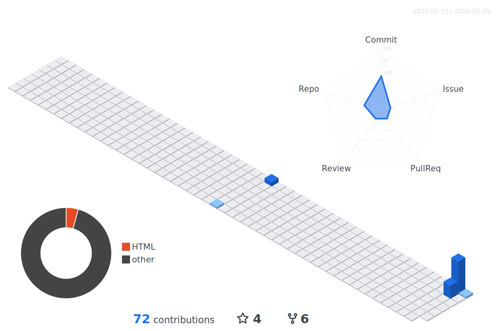

---

### About

Backend engineer from China.

Focused on distributed systems,
message queues,
large-scale data processing,
and unreliable third-party integrations.

Mostly working on:

* scalable backend architecture
* distributed task orchestration
* system reliability & resilience
* high-throughput data pipelines
* production infrastructure

I care about stability,
performance,
and systems that quietly survive production.

Working with:
.NET 8 · Go · Rust · MySQL · Redis · RabbitMQ

Currently exploring:
AI agents · self-hosted infrastructure · automation workflows

Recently getting deeper into Rust,
especially around systems programming,
performance-oriented tooling,
and reliable concurrent services.

[blog](https://ponponboy.cn/) · [email](mailto:jojoseisai@gmail.com)

---

中文简介

> 后端工程师，来自中国。

主要关注：

* 分布式系统
* 消息队列
* 大规模数据处理
* 第三方系统对接

平时更多在做：

* 可扩展后端架构
* 分布式任务编排
* 系统稳定性与韧性设计
* 高吞吐数据管道
* 生产环境基础设施

比较在意系统稳定性、性能，
以及那些能在生产环境里长期安静运行的系统。

技术栈：
.NET 8 · Go · Rust · MySQL · Redis · RabbitMQ

最近在折腾：
AI Agent · 自托管基础设施 · 自动化工作流

最近也开始深入接触 Rust，
对系统编程、高性能工具链、
以及可靠并发服务比较感兴趣。

[博客](https://ponponboy.cn/) · [邮箱](mailto:jojoseisai@gmail.com)

---

### Activity

  
  &nbsp;&nbsp;
  

 

  

 

  

---

*"Good programmers write code that humans can understand." — Martin Fowler*

